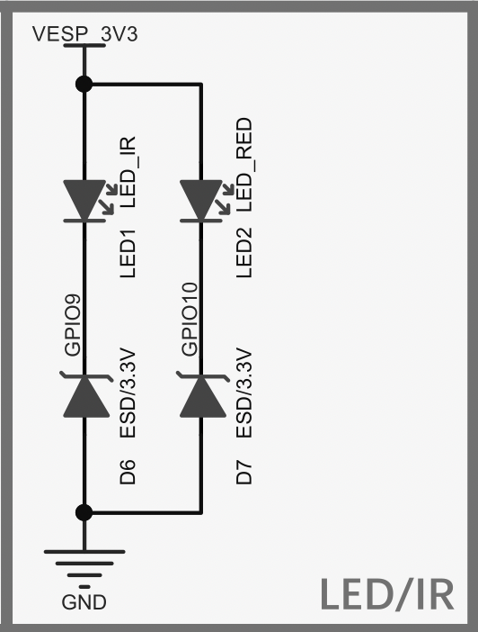

# IR transmition

The M5Stick C Plus's IR LED doesn't emit strong IR light 
like a remote control. 
Be sure to move close to the receiver 
and adjust the angle 
so that the IR LED is pointing to the receiver.

## logic level
As the schematic shows, the IR LED is 0V active.

